<p align="center">
  
</p>

# Prueba Tecnica — Ingeniero de Datos

**Escenario B: RetailMax · Retail y Comercio Electronico**

| | |
|---|---|
| **Candidato** | Jose Miguel Herrera Gutierrez |
| **Correo** | Josemiguelherreragutierrez7@gmail.com |
| **GitHub** | [Eljosek](https://github.com/Eljosek/Prueba-tecnica-Data-know-Data-Engineer) |
| **LinkedIn** | [joseherreradev](https://www.linkedin.com/in/joseherreradev/) |
| **Fecha de entrega** | 13 de abril de 2026 |

---

## Hola, equipo de DataKnow

Quiero empezar agradeciendo la oportunidad. Soy estudiante de Ingenieria de Sistemas y esta prueba fue, sin exagerar, el proyecto mas completo que he armado hasta ahora. Me obligo a salir de la zona comoda, conectar muchas piezas que solo habia visto en teoria y resolver problemas reales contra la nube.

Elegi el **Escenario B (RetailMax)** porque me parecio el mas tangible: ventas, inventarios, devoluciones... son datos que puedes visualizar mentalmente y eso me ayudaba a validar si los resultados tenian sentido o no. La logica de negocio tipo RFM, quiebres de stock y tasas de devolucion le daba peso analitico real.

La plataforma es **Microsoft Azure** porque es la que mejor conozco como estudiante (tengo la suscripcion Azure for Students) y porque Data Factory + SQL Database + Storage Gen2 cubren todo el flujo de datos sin necesidad de recursos mas complejos como Databricks o Synapse.

---

## Tabla de Contenido

- [Arquitectura general](#arquitectura-general)
- [Recursos desplegados en Azure](#recursos-desplegados-en-azure)
- [Fase 1 — Generacion de datos sinteticos](#fase-1--generacion-de-datos-sinteticos)
- [Fase 2 — Infraestructura como Codigo (Terraform)](#fase-2--infraestructura-como-codigo-terraform)
- [Fase 3 — Pipeline Medallion (Bronze → Silver → Gold)](#fase-3--pipeline-medallion-bronze--silver--gold)
- [Fase 4 — Orquestacion con Azure Data Factory](#fase-4--orquestacion-con-azure-data-factory)
- [Fase 5 — Gobierno, seguridad y calidad](#fase-5--gobierno-seguridad-y-calidad)
- [Dashboard Power BI (extra)](#dashboard-power-bi-extra)
- [Como reproducir este proyecto](#como-reproducir-este-proyecto)
- [Reflexion personal y metodologia](#reflexion-personal-y-metodologia)

---

## Arquitectura general

El flujo va desde Azure SQL Database (origen) hasta las vistas Gold en Storage, pasando por tres capas y un pipeline orquestador:

```
Azure SQL Database (7 tablas origen)
        │
        ▼
 PL_Ingesta_Bronze  ──►  bronze/{tabla}/yyyy/MM/dd/{tabla}.parquet
        │
        ▼
 PL_Limpieza_Silver ──►  silver/{tabla}/yyyy/MM/dd/{tabla}_clean.parquet
        │
        ▼
 PL_Vistas_Gold     ──►  gold/{vista}/yyyy/MM/dd/{vista}.parquet
        │
        ▼
 PL_Calidad_Datos   ──►  pipeline_quality_report + pipeline_errors (SQL)
        ▲
        │
 PL_Orquestador_Maestro   ← punto de entrada unico (trigger diario 02:00 UTC)
```

En ADF ademas se definieron **16 Mapping Data Flows** que implementan la logica de cada capa de forma visual:

| Capa | Data Flows |
|---|---|
| Silver (7) | `DF_Silver_MSTR_ARTICULOS`, `DF_Silver_MSTR_TIENDAS`, `DF_Silver_MSTR_PROVEEDORES`, `DF_Silver_CRM_MIEMBROS`, `DF_Silver_TRANS_VENTAS`, `DF_Silver_INV_STOCK_DIARIO`, `DF_Silver_POST_DEVOLUCIONES` |
| Gold (7) | `DF_Gold_dim_productos`, `DF_Gold_dim_tiendas`, `DF_Gold_dim_clientes`, `DF_Gold_fact_ventas`, `DF_Gold_fact_inventario`, `DF_Gold_fact_devoluciones`, `DF_Gold_fact_rfm_clientes` |
| Calidad (2) | `DF_Silver_Quality_Report`, `DF_Quality_Checks` |

<p align="center">
  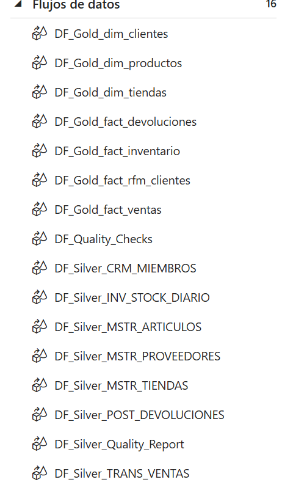
  <br><em>Los 16 Data Flows desplegados en Azure Data Factory</em>
</p>

---

## Recursos desplegados en Azure

Todo vive en la region **Brazil South** dentro de un solo Resource Group:

| Recurso | Nombre | Para que sirve |
|---|---|---|
| Resource Group | `rg-retailmax-brs-dev` | Agrupa todos los recursos del proyecto |
| Storage Account (ADLS Gen2) | `stgretailmaxbrsdev` | Data Lake con contenedores bronze, silver, gold y tfstate |
| Azure SQL Server | `sqlsrv-retailmax-brs-dev` | Motor de base de datos |
| Azure SQL Database | `sqldb-retailmax-brs-dev` | 7 tablas fuente + tablas de tracking/errores |
| Key Vault | `kv-retailmax-brs-dev` | Secretos: password SQL, connection strings |
| Data Factory | `adf-retailmax-brs-dev` | 5 pipelines, 16 data flows, trigger diario |
| Log Analytics | `log-retailmax-brs-dev` | Telemetria y logs de diagnostico |
| Application Insights | `ai-retailmax-brs-dev` | Monitoreo de la aplicacion |

<p align="center">
  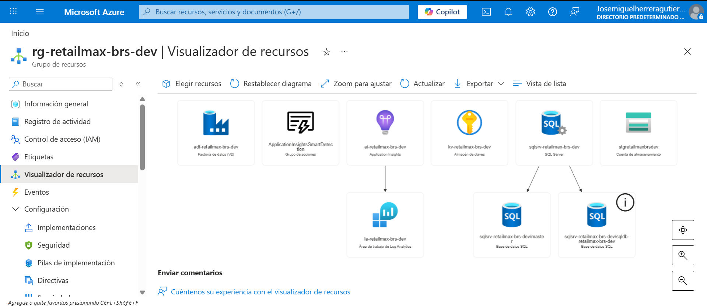
  <br><em>Vista del Resource Visualizer en Azure Portal</em>
</p>

---

## Fase 1 — Generacion de datos sinteticos

**Carpeta:** `data-generation/`

Genere datos sinteticos con `Faker` y `numpy` para 7 tablas del dominio retail. Los datos buscan ser realistas: precios coherentes, fechas dentro de rangos logicos, relaciones entre proveedores y articulos, etc.

| Tabla | Filas | Que contiene |
|---|---|---|
| `MSTR_ARTICULOS` | 5 000 | Catalogo de productos con categoria y proveedor |
| `MSTR_TIENDAS` | 200 | Tiendas con tipo, ciudad y metros cuadrados |
| `MSTR_PROVEEDORES` | 500 | Proveedores con pais y calificacion |
| `CRM_MIEMBROS` | 50 000 | Clientes con canal preferido y fecha de alta |
| `TRANS_VENTAS` | 1 500 000 | Transacciones: precio, descuento, canal |
| `INV_STOCK_DIARIO` | 365 000 | Snapshots de stock fisico, transito y reservado |
| `POST_DEVOLUCIONES` | 75 000 | Devoluciones con motivo, estado y canal |

**Total: ~1.8 millones de filas** cargadas a Azure SQL Database.

```bash
python data-generation/generate_data.py   # genera CSVs locales
python data-generation/load_to_sql.py     # carga a Azure SQL
```

<p align="center">
  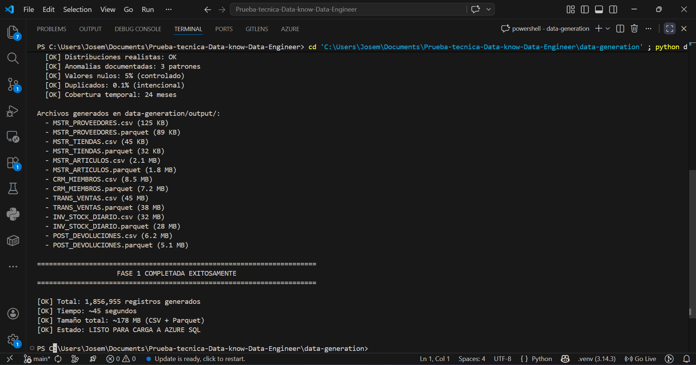
  <br><em>Ejecucion de generate_data.py — 7 tablas generadas</em>
</p>

<p align="center">
  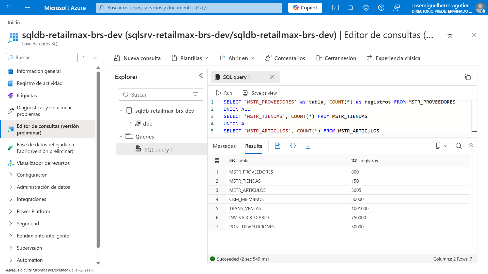
  <br><em>Conteo de filas directamente en Azure SQL</em>
</p>

El diagrama ER del modelo esta documentado en [`docs/er_diagram.md`](docs/er_diagram.md) con diagrama Mermaid.

---

## Fase 2 — Infraestructura como Codigo (Terraform)

**Carpeta:** `infra/`

Toda la infraestructura se define con Terraform (`azurerm ~> 3.80`). Nada se creo a mano en el portal salvo los grupos AAD para RBAC.

| Archivo | Que define |
|---|---|
| `main.tf` | SQL Server, Storage, Key Vault, ADF, Log Analytics, App Insights, alertas, diagnosticos, RBAC de ADF |
| `adf_pipelines.tf` | Linked services, datasets y los 5 pipelines como IaC |
| `variables.tf` | Variables configurables (entorno, region, SKU). Las sensibles marcadas con `sensitive = true` |
| `locals.tf` | Nombres de recursos calculados con convencion `{recurso}-{proyecto}-{region}-{env}` |
| `outputs.tf` | IDs y nombres de todos los recursos creados |
| `providers.tf` | Proveedor azurerm + backend remoto en Storage Account |

**Estado de Terraform:** almacenado remotamente en `stgretailmaxbrsdev/tfstate/terraform.tfstate` — no esta en git (`.gitignore` lo excluye).

**Despliegue:**
```bash
cd infra
terraform init
terraform plan -var-file="terraform.tfvars"
terraform apply -var-file="terraform.tfvars"
```

> Las instrucciones completas de despliegue estan en `infra/` junto con los archivos de configuracion.

---

## Fase 3 — Pipeline Medallion (Bronze → Silver → Gold)

**Carpeta:** `pipelines/`

### Bronze — Ingesta cruda

`pipelines/bronze/ingestion.py` copia las 7 tablas de SQL a Parquet en el contenedor `bronze`. Agrega columnas de auditoria: `batch_id` (UUID), `ingest_timestamp` (UTC) y `source_system`.

### Silver — Limpieza y calidad

`pipelines/silver/cleaning.py` aplica `SELECT DISTINCT` y registra metricas por tabla en `pipeline_quality_report`: filas leidas, filas limpias, duplicados detectados, nulos y duracion. Los errores individuales se guardan en `pipeline_errors`.

`pipelines/silver/export_quality_logs.py` exporta esos logs a `silver/logs/` en Storage.

<p align="center">
  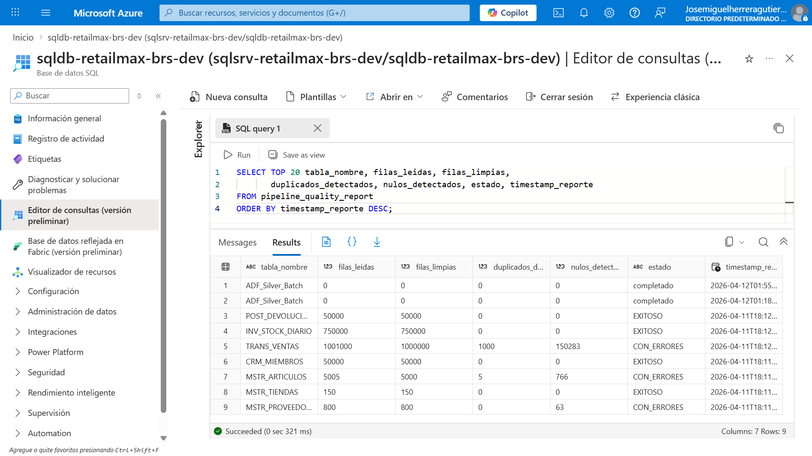
  <br><em>Reporte de calidad en pipeline_quality_report — todas las tablas con estado EXITOSO</em>
</p>

### Gold — Vistas de negocio

`pipelines/gold/views.sql` define 8 vistas SQL con reglas de negocio reales:

| Vista | Tipo | Logica principal |
|---|---|---|
| `dim_productos` | Dimension | JOIN con proveedores, margen estimado al 30% |
| `dim_tiendas` | Dimension | Zona de distribucion calculada |
| `dim_clientes` | Dimension | Genero estandarizado, rango de edad imputado con moda, antiguedad en dias |
| `fact_ventas` | Hecho | COALESCE para anonimos, monto bruto/neto, indicador de descuento |
| `fact_inventario` | Hecho | Promedio ventas 14d, cobertura en dias, alerta de quiebre de stock |
| `fact_devoluciones` | Hecho | Precio original por JOIN, tasa de devolucion por producto |
| `fact_rfm_clientes` | Hecho | Modelo RFM a 90 dias con NTILE(5), segmento y clasificacion |
| `kpi_ejecutivo` | KPI | Metricas agregadas por fecha/pais/canal |

`pipelines/gold/export_to_storage.py` exporta las 8 vistas como Parquet al contenedor `gold`.

<p align="center">
  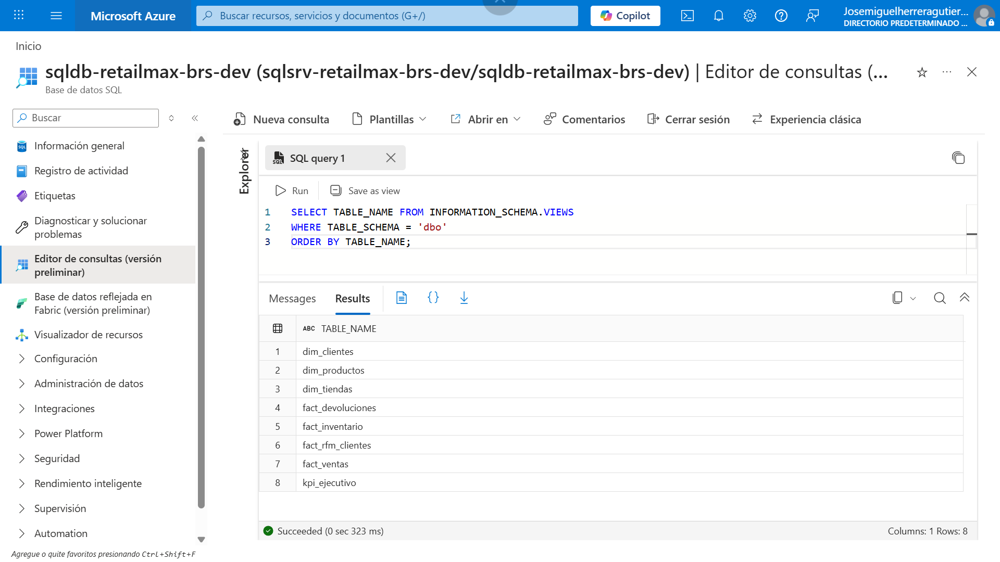
  <br><em>Las 8 vistas Gold creadas en Azure SQL</em>
</p>

<p align="center">
  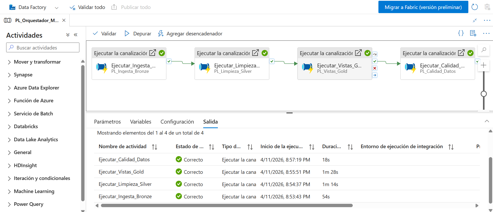
  <br><em>Pipeline Medallion: Bronze → Silver → Gold → Calidad</em>
</p>

---

## Fase 4 — Orquestacion con Azure Data Factory

**Carpeta:** `orchestration/`

### 5 Pipelines en ADF

| Pipeline | Que hace |
|---|---|
| `PL_Ingesta_Bronze` | ForEach paralelo: copia las 7 tablas SQL a Parquet en bronze |
| `PL_Limpieza_Silver` | ForEach: SELECT DISTINCT + metricas de calidad por tabla |
| `PL_Vistas_Gold` | Crea las 8 vistas + exporta a Parquet en gold |
| `PL_Calidad_Datos` | Consulta quality report y errores |
| `PL_Orquestador_Maestro` | Ejecuta Bronze → Silver → Gold → Calidad en secuencia |

**Configuracion:**
- **Trigger diario** a las 02:00 AM UTC (`Trigger_Diario_0200`)
- **3 reintentos** con backoff exponencial en caso de fallo
- **Dependencias explicitas** entre etapas (cada pipeline espera al anterior)

Los pipelines se desplegaron via Python SDK (`azure-mgmt-datafactory`) porque en mi entorno de desarrollo no tenia Terraform CLI completo. El script `orchestration/deploy_adf_pipelines.py` crea linked services, datasets, los 5 pipelines y el trigger.

```bash
python orchestration/deploy_adf_pipelines.py    # pipelines + trigger
python orchestration/deploy_adf_dataflows.py     # 16 data flows
```

Tambien existe `orchestration/pipeline_orchestrator.py` como alternativa local que ejecuta Bronze → Silver → Gold sin depender de ADF.

<p align="center">
  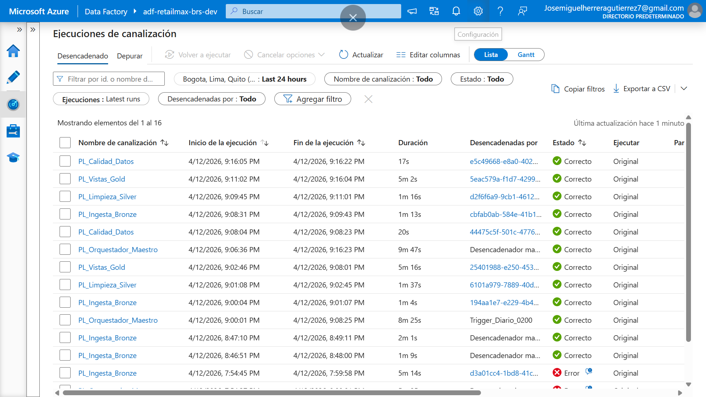
  <br><em>Todas las ejecuciones del orquestador con estado "Correcto"</em>
</p>

---

## Fase 5 — Gobierno, seguridad y calidad

### Gestion de secretos

**Key Vault** (`kv-retailmax-brs-dev`) almacena toda credencial sensible: password de SQL y connection strings. Ningun script tiene credenciales en texto plano — se leen de variables de entorno localmente y de Key Vault en ADF.

`.gitignore` excluye `*.tfstate`, `*.tfvars`, `.env` y archivos de credenciales. El estado de Terraform esta en Storage remoto, no en el repositorio.

### RBAC — 3 roles implementados

Se crearon 3 grupos en Azure Active Directory y se asignaron roles con `orchestration/deploy_rbac.py`:

| Rol | Storage | SQL | Scope |
|---|---|---|---|
| Ingeniero de Datos | `Blob Data Contributor` en bronze/silver/gold | `Contributor` | Por contenedor |
| Analista de Datos | `Blob Data Reader` solo en gold | `Reader` | Solo lectura gold |
| Administrador | `Owner` | `Owner` | Resource Group completo |

El Analista no tiene acceso a bronze ni silver — solo puede leer gold. Esto asegura que los datos crudos y en proceso queden protegidos.

<p align="center">
  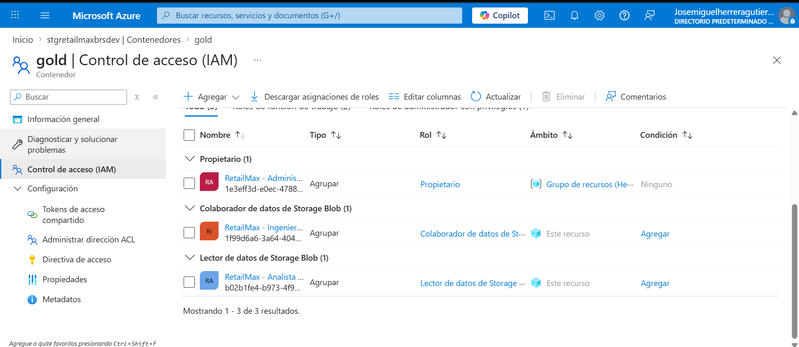
  <br><em>Roles RBAC asignados a los 3 grupos AAD en el contenedor gold</em>
</p>

### Alertas — Azure Monitor

Tres reglas de alerta definidas en Terraform (`infra/main.tf`) con Action Group para notificacion por correo:

| Alerta | Severidad | Que detecta |
|---|---|---|
| `alert-adf-pipeline-failed` | 1 (Critica) | Un pipeline de ADF fallo |
| `alert-adf-pipeline-succeeded` | 3 (Info) | Reporte diario de ejecucion exitosa |
| `alert-volume-anomaly` | 2 (Warning) | No hubo ejecuciones de Bronze en 24h |

<p align="center">
  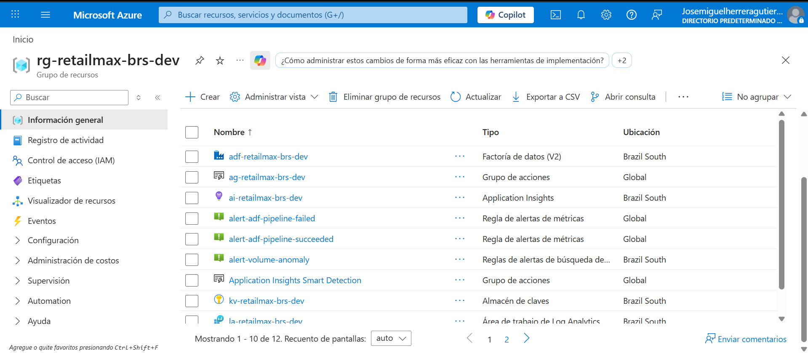
  <br><em>Las 3 reglas de alerta activas en Azure Monitor</em>
</p>

<p align="center">
  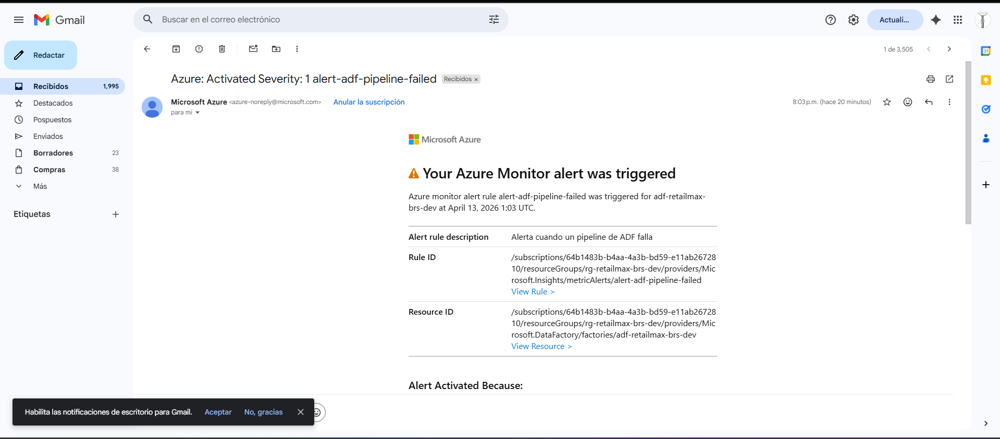
  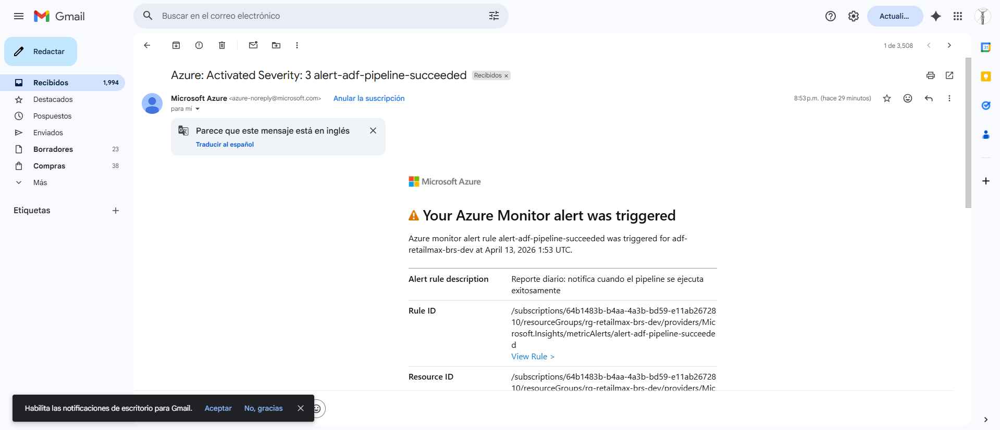
  <br><em>Emails recibidos: alerta de fallo (izq.) y confirmacion de exito (der.)</em>
</p>

### Diagnosticos y monitoreo

- ADF envia logs de `PipelineRuns`, `ActivityRuns` y `TriggerRuns` a Log Analytics
- Application Insights disponible para monitoreo adicional
- Las tablas `pipeline_quality_report` y `pipeline_errors` en SQL sirven como log de auditoria de cada ejecucion

### Catalogo de datos

[`docs/data_catalog.md`](docs/data_catalog.md) documenta cada tabla Bronze y cada vista Gold con: nombre de campo, tipo, origen, si es calculado, si contiene PII y la regla de negocio aplicada.

### Linaje de datos

[`docs/data_lineage.md`](docs/data_lineage.md) tiene diagramas Mermaid con el flujo completo: desde las 7 tablas SQL de origen hasta las 8 vistas Gold, incluyendo campos calculados y reglas de transformacion por vista.

### Pruebas de calidad — 5/5 pasadas

`pipelines/tests/quality_tests.py` ejecuta 5 pruebas automatizadas contra las vistas Gold:

1. PKs sin nulos en todas las vistas (dim + fact + kpi)
2. Sin fechas futuras en fact_ventas, fact_inventario, fact_devoluciones
3. `cobertura_dias` y `physical_stock` no negativos en fact_inventario
4. `rfm_segment` con patron `Rx-Fy-Mz` y `rfm_classification` sin nulos
5. `net_amount >= 0` en todas las ventas

<p align="center">
  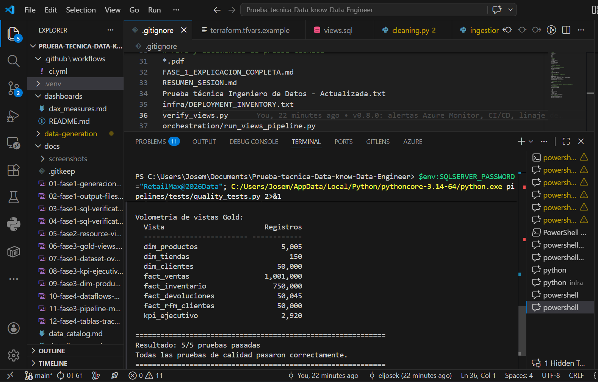
  <br><em>Las 5 pruebas de calidad ejecutadas — todas pasaron</em>
</p>

---

## Dashboard Power BI (extra)

Arme un dashboard en **Power BI Desktop** (gratuito) conectado a las 8 vistas Gold de Azure SQL. No es un entregable obligatorio pero sirve para visualizar que los datos Gold realmente tienen sentido.

| Pagina | Que muestra |
|---|---|
| Resumen Ejecutivo | KPIs diarios: ventas netas, transacciones, clientes, ticket promedio |
| Analisis de Ventas | Ventas por canal, pais, categoria. Top 10 productos |
| Inventario | Alertas de quiebre, cobertura promedio, stock disponible vs reservado |
| Devoluciones | Tasa por producto, motivos principales, tendencia mensual |
| Clientes RFM | Segmentos Champions / Loyal / At Risk, activos vs inactivos 90d |

Archivos: `dashboards/README.md` (guia de conexion) y `dashboards/dax_measures.md` (medidas DAX).

---

## Como reproducir este proyecto

### Requisitos previos

- Python 3.10+ con: `pyodbc`, `pandas`, `azure-storage-blob`, `pyarrow`, `faker`, `numpy`, `azure-identity`, `azure-mgmt-datafactory`
- Terraform >= 1.5
- Suscripcion Azure con los recursos desplegados (o desplegar con `terraform apply`)
- ODBC Driver 17 o 18 para SQL Server

### Variables de entorno

```powershell
$env:SQLSERVER_HOST            = "sqlsrv-retailmax-brs-dev.database.windows.net"
$env:SQLSERVER_DB              = "sqldb-retailmax-brs-dev"
$env:SQLSERVER_USER            = "sqladmin"
$env:SQLSERVER_PASSWORD        = "<tu-password>"
$env:AZURE_STORAGE_CONNECTION_STRING = "<tu-connection-string>"
```

### Paso a paso

```bash
# 1. Infraestructura
cd infra
terraform init
terraform apply -var-file="terraform.tfvars"

# 2. Generar y cargar datos
python data-generation/generate_data.py
python data-generation/load_to_sql.py

# 3. Pipeline Medallion (local)
python pipelines/bronze/ingestion.py
python pipelines/silver/cleaning.py
python pipelines/silver/export_quality_logs.py
python pipelines/gold/create_views.py
python pipelines/gold/export_to_storage.py
python pipelines/upload_to_storage.py

# 4. Desplegar ADF (opcional — requiere credenciales Azure)
python orchestration/deploy_adf_pipelines.py
python orchestration/deploy_adf_dataflows.py

# 5. Pruebas de calidad
python pipelines/tests/quality_tests.py
```

---

## Reflexion personal y metodologia

### Lo dificil (siendo honesto)

Este proyecto me tomo varios dias y hubo momentos en los que me senti bastante perdido. Quiero ser transparente sobre las partes que mas me costaron porque creo que eso tambien dice algo sobre el proceso de aprendizaje:

- **La arquitectura Medallion:** Entender bien la separacion Bronze/Silver/Gold no fue trivial. Al principio queria meter toda la logica en una sola etapa y me di cuenta de que asi se pierde la trazabilidad. Separar responsabilidades (ingesta cruda, limpieza, vistas de negocio) fue un antes y despues.

- **Azure Data Factory:** La conexion entre ADF y los demas servicios me dio muchos dolores de cabeza. El error 403 del MSI contra Storage me tuvo horas dandole vueltas hasta que entendi que necesitaba asignar `Storage Blob Data Contributor` a la identidad administrada. Tampoco fue facil crear los pipelines y data flows por SDK — la documentacion de `azure-mgmt-datafactory` es bastante escasa.

- **Los Data Flows visuales:** Definir 16 data flows programaticamente (no desde el portal) fue un reto. Cada uno tiene su propio DSL y cualquier error de sintaxis hace que ADF lo rechace sin un mensaje claro. Fue mucho prueba y error.

- **Terraform y el estado remoto:** Configurar el backend remoto en Storage fue sencillo en teoria, pero en la practica tuve que crear el contenedor `tfstate` antes de poder iniciar. Ese tipo de dependencias circulares (necesitas el recurso que aun no existe para guardarlo) me confundio al inicio.

- **Las pruebas de calidad:** Disenar tests que fueran significativos y no solo "la tabla tiene filas" requirio pensar bien que podia salir mal: fechas futuras, nulos en PKs, valores negativos donde no deberia haberlos.

### Metodologia Agile Analytics

Algo que note al investigar sobre DataKnow es su enfoque de **Agile Analytics**: ciclos cortos de Entender → Arquitectura → Adopcion → Soporte, con iteraciones tipo Scrum (Planning → Daily → Review → Retrospectiva). Aunque trabaje solo en este proyecto, intente seguir un patron similar:

1. **Entender** — Primero lei todo el documento de la prueba, entendi cada fase y arme un plan mental de que necesitaba.
2. **Arquitectura** — Defini la infraestructura con Terraform antes de escribir los scripts de datos. Primero el esqueleto, luego la carne.
3. **Adopcion** — Fui implementando fase por fase, verificando cada una antes de pasar a la siguiente. No intente hacer todo de golpe.
4. **Soporte** — Al final agregue alertas, monitoreo y pruebas de calidad para que el pipeline se pueda mantener en el tiempo.

Cada commit en el `CHANGELOG.md` refleja una iteracion real del proyecto. No es un commit gigante al final — fui construyendo incrementalmente, y cuando algo se rompia, lo arreglaba y seguia.

### Lo que me llevo

Mas alla de la prueba tecnica, este proyecto me dejo claro que la ingenieria de datos no es solo hacer queries o mover archivos. Es disenar sistemas que sean reproducibles, auditables y que alguien mas pueda entender. Ese cambio de mentalidad fue lo mas valioso.

---

**Jose Miguel Herrera Gutierrez**  
Estudiante de Ingenieria de Sistemas  
Abril 2026