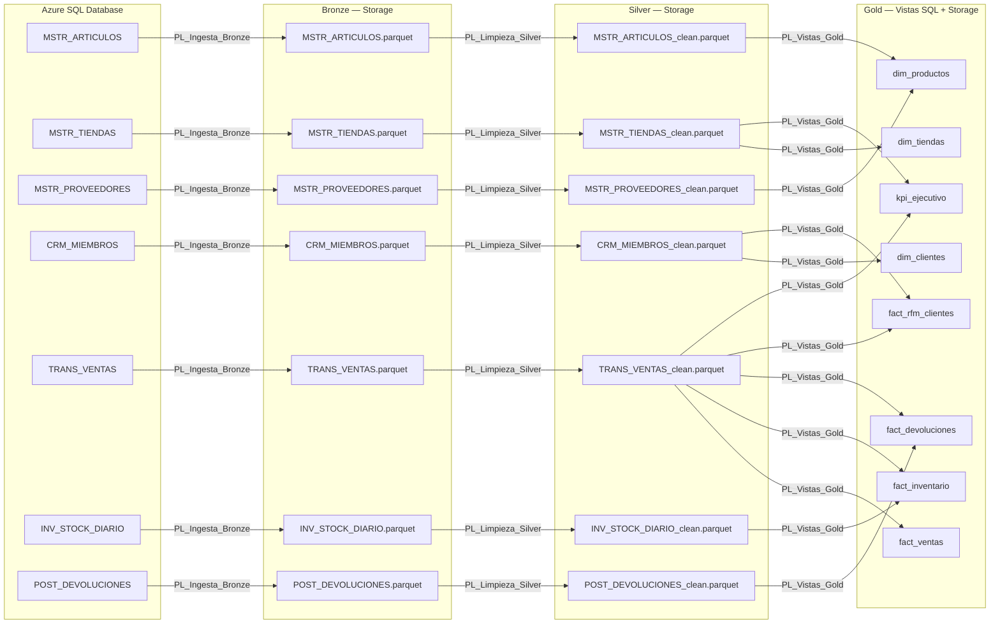
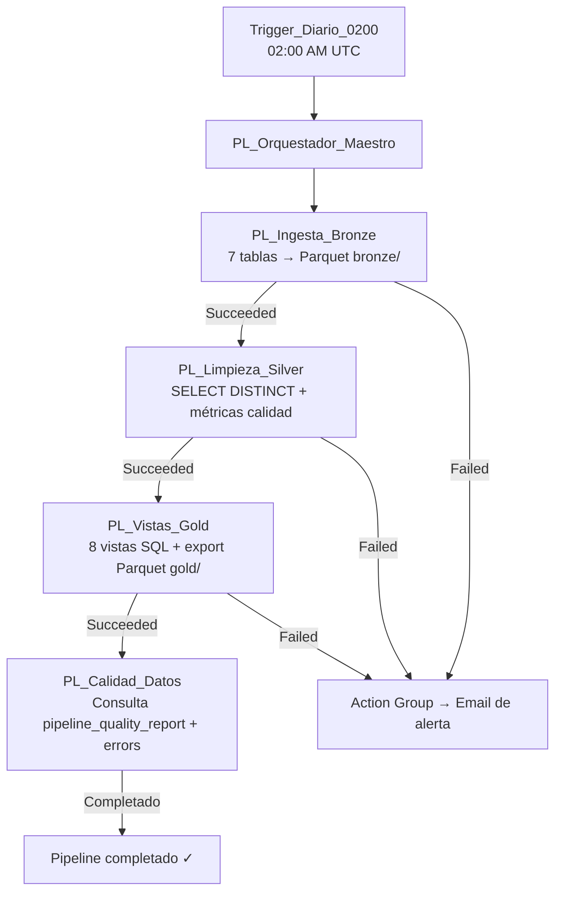

# Linaje de Datos — RetailMax

**Fase 5 — Escenario B: Retail y Comercio Electrónico**  
Fecha: Abril 12, 2026

---

## Flujo General

---

## Detalle por Vista Gold

### dim_productos
| Campo calculado | Tablas origen | Regla de negocio |
|---|---|---|
| `supplier_name` | `MSTR_ARTICULOS` + `MSTR_PROVEEDORES` | LEFT JOIN por `id_proveedor` |
| `supplier_quality_score` | `MSTR_PROVEEDORES` | Directo de la fuente |
| `estimated_margin` | `MSTR_ARTICULOS` | `precio_lista * 0.30` |

### dim_tiendas
| Campo calculado | Tablas origen | Regla de negocio |
|---|---|---|
| `zona_distribucion` | `MSTR_TIENDAS` | `CASE id_pais % 5` → Norte/Sur/Este/Oeste/Centro |

### dim_clientes
| Campo calculado | Tablas origen | Regla de negocio |
|---|---|---|
| `gender` | `CRM_MIEMBROS` | Estandarización: O/NULL → `No_informado` |
| `age_range` | `CRM_MIEMBROS` | Imputación de nulos con moda por `canal_pref` |
| `antiguedad_dias` | `CRM_MIEMBROS` | `DATEDIFF(DAY, fec_registro, GETDATE())` |

### fact_ventas
| Campo calculado | Tablas origen | Regla de negocio |
|---|---|---|
| `customer_id` | `TRANS_VENTAS` | `COALESCE(id_miembro, 'ANONIMO')` |
| `gross_amount` | `TRANS_VENTAS` | `qty_vendida * precio_unitario_venta` |
| `net_amount` | `TRANS_VENTAS` | `gross_amount - descuento_aplicado` |
| `ind_con_descuento` | `TRANS_VENTAS` | `1` si `descuento > 0`, `0` si no |

### fact_inventario
| Campo calculado | Tablas origen | Regla de negocio |
|---|---|---|
| `avg_daily_sales_14d` | `INV_STOCK_DIARIO` + `TRANS_VENTAS` | CTE ventas últimos 14 días / 14 |
| `cobertura_dias` | Calculado | `stock_fisico / avg_daily_sales_14d` |
| `alerta_quiebre` | Calculado | `1` si cobertura < 7 días con demanda activa |

### fact_devoluciones
| Campo calculado | Tablas origen | Regla de negocio |
|---|---|---|
| `original_unit_price` | `POST_DEVOLUCIONES` + `TRANS_VENTAS` | JOIN por `id_trans_origen` |
| `return_rate_by_product` | Calculado | CTE: `SUM(devueltas) / SUM(vendidas)` por artículo |

### fact_rfm_clientes
| Campo calculado | Tablas origen | Regla de negocio |
|---|---|---|
| `recency_days` | `CRM_MIEMBROS` + `TRANS_VENTAS` | `DATEDIFF` desde última compra (ventana 90 días) |
| `frequency_purchases` | `TRANS_VENTAS` | `COUNT(DISTINCT id_trans)` en 90 días |
| `monetary_value` | `TRANS_VENTAS` | `SUM(qty * precio - descuento)` en 90 días |
| `r_score`, `f_score`, `m_score` | Calculado | `NTILE(5)` sobre cada métrica |
| `rfm_segment` | Calculado | Concatenación `R#-F#-M#` |
| `rfm_classification` | Calculado | Champions / Loyal / At_Risk / Other |

### kpi_ejecutivo
| Campo calculado | Tablas origen | Regla de negocio |
|---|---|---|
| `total_transacciones` | `TRANS_VENTAS` + `MSTR_TIENDAS` | `COUNT(DISTINCT id_trans)` por fecha/país/canal |
| `clientes_unicos` | `TRANS_VENTAS` | `COUNT(DISTINCT id_miembro)` |
| `ventas_brutas` | `TRANS_VENTAS` | `SUM(qty * precio)` |
| `ventas_netas` | `TRANS_VENTAS` | `SUM(qty * precio - descuento)` |

---

## Trazabilidad de Ejecución

| Tabla SQL | Propósito |
|---|---|
| `pipeline_quality_report` | Registro de métricas por tabla: filas leídas, limpias, duplicados, nulos, estado |
| `pipeline_errors` | Registro de errores individuales con timestamp y detalle |

---

## Cadena de Orquestación

