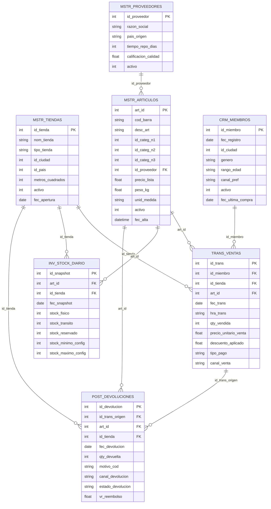

# Diagrama Entidad-Relación - RetailMax

**Fase 1 - Escenario B: Retail & E-commerce**
Fecha: Abril 9, 2026

## Diagrama ER (Mermaid)

## Descripción de tablas

### Tablas Maestras (MSTR)

| Tabla | Registros | Descripción |
|---|---|---|
| `MSTR_PROVEEDORES` | 800 | Proveedores de productos. Incluye calificación de calidad y tiempo de reposición |
| `MSTR_TIENDAS` | 150 | Tiendas físicas y online. Clasificadas por tipo (Hipermercado, Supermercado, Conveniencia) |
| `MSTR_ARTICULOS` | 5 000 | Catálogo de artículos con jerarquía de categorías (3 niveles) y vínculo al proveedor |

### Tablas Transaccionales (TRANS / POST)

| Tabla | Registros | Descripción |
|---|---|---|
| `TRANS_VENTAS` | 1 000 000 | Todas las transacciones de venta. Tabla central del modelo |
| `POST_DEVOLUCIONES` | 50 000 | Devoluciones vinculadas a transacciones origen |

### Tabla CRM

| Tabla | Registros | Descripción |
|---|---|---|
| `CRM_MIEMBROS` | 50 000 | Clientes del programa de fidelización |

### Tabla de Inventario (INV)

| Tabla | Registros | Descripción |
|---|---|---|
| `INV_STOCK_DIARIO` | 750 000 | Snapshot diario de inventario por artículo y tienda |

## Anomalías intencionales en los datos

Los datos incluyen las siguientes anomalías documentadas para validar la robustez de los pipelines:

| Tipo | Tasa | Descripción |
|---|---|---|
| Duplicados exactos | 0.1% | Registros duplicados íntegros |
| Valores nulos | 5% | Nulos en columnas de texto |
| Valores fuera de rango | 0.1% | Outliers numéricos extremos |
| Violaciones de FK | 0.5% | Referencias a IDs inexistentes |

## Relaciones principales

- **TRANS_VENTAS** es la tabla central: referencia artículo, tienda y miembro
- **MSTR_ARTICULOS** está vinculada al proveedor por `id_proveedor`
- **POST_DEVOLUCIONES** referencia la transacción origen por `id_trans_origen`
- **INV_STOCK_DIARIO** captura el inventario diario cruzando artículo y tienda
